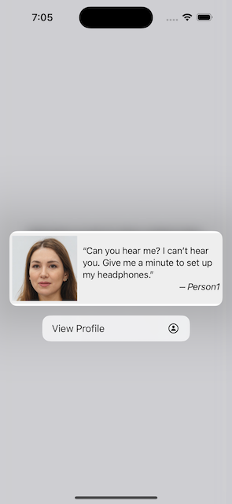
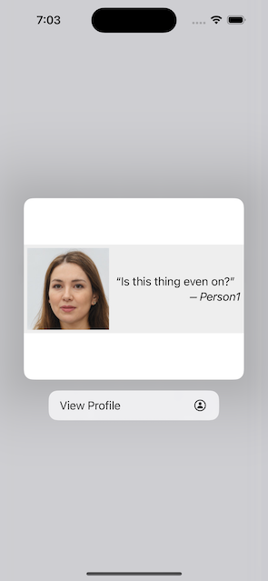
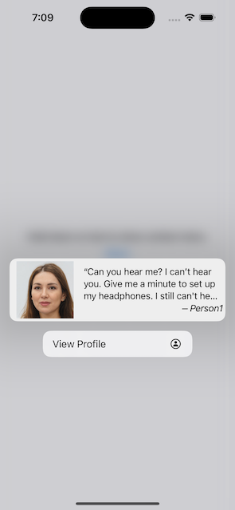

# PreviewConfusion

I'm trying to get the preview to consistently match the size of the content, which can be any (reasonable) length.

What do I mean?

We've got a few major areas here:

1. The main view. We can just ignore this. It's there, maining, just like you'd expect.
2. Buttons to hold (not tap) to activate previews.
3. The ContextMenu preview (white background).
4. The hosted PreviewView (light grey background).

Now let's look at how things have gone wrong.

### Medium Message

I put this first because this actually looks pretty good. It's probably just luck, but at least it explains what it should look like: there's minimal spacing above and below the photo and text.

### Short Message

Things have gone so horribly wrong here, and not in the direction I was expecting. The preview area is smaller despite having more content. But then the ContextMenu preview gets swole. Why does this short message get high white bars above and below it?

### Long Message

This isn't right, either, but at least predictably so. The content area within the preview is too small, so the message has been truncated.

Here, the content area 

